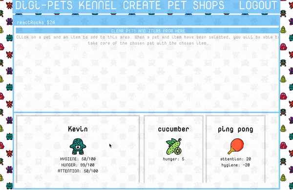

## Digi - Pets

Digi - Pets is a casual game web game, where a player can create pets and care for them after purchasing items at various shops.

This is the backend repo for Digi - Pets, the frontend can be found at the following address:

https://github.com/MichelleNguy/digi-pet-frontend

### Motivation

Neopets nostgolia.

### Demo




#### Video below:

[](https://www.youtube.com/watch?v=UNI6m8VSLF8 "Digi-pets demo")

### Screenshots


### Installation
1. Clone repo and CD into the directory
2. ```bundle install```
3. run ```rails db:create``` to create your postgres database
4. run ```rails db:migrate``` to bring up migrations
5. run ```rails db:seed``` to seed data for shops and items
6. run ```rails s``` to start the server

Make sure to checkout the repo for the frontend and follow the installation
instructions as well.

### Tech/Frameworks

+ Ruby on Rails API
+ JWT Auth
+ Active Model Serializer

### License

MIT © Michelle Nguyen
